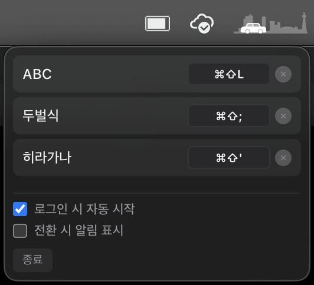

# KISS

<p align="center">
  
</p>

<p align="center">
  <strong>K</strong>eyboard <strong>I</strong>nput <strong>S</strong>ource <strong>S</strong>witcher for macOS
</p>

<p align="center">
  
  
</p>

A simple macOS menu bar app that lets you switch keyboard input sources with custom keyboard shortcuts.

## Screenshots

<p align="center">
  
</p>


## Features

- Global keyboard shortcuts for each input source
- Menu bar (tray) integration
- Notification on input source change
- Launch at login
- Multi-language support (auto-detected from system)
  - English, Korean, Japanese, Chinese (Simplified/Traditional)
  - Spanish, French, German, Portuguese, Italian, Russian
  - Vietnamese, Thai, Arabic
- Lightweight and fast

## Installation

Download the latest release from the [Releases](https://github.com/jeonghyeon-net/kiss/releases) page.

1. Download `KISS-x.x.x-arm64.dmg`
2. Open the DMG file
3. Drag KISS to your Applications folder
4. Open KISS from Applications

> **Note:** On first launch, macOS may ask for accessibility permissions. Grant the permission in System Preferences > Security & Privacy > Privacy > Accessibility.

## Usage

1. Click the keyboard icon in the menu bar to open the settings
2. Click "Set Shortcut" next to an input source
3. Press your desired key combination (e.g., ⌘+1, ⌥+Space)
4. Use the shortcut anywhere to switch input sources

## Development

### Prerequisites

- Node.js 18+
- Xcode Command Line Tools (for Swift helper)

### Setup

```bash
git clone https://github.com/jeonghyeon-net/kiss.git
cd kiss
npm install
```

### Run in development mode

```bash
npm run dev
```

### Build

```bash
npm run build
```

Build artifacts will be in the `release/` directory.

### Project Structure

```
kiss/
├── electron/           # Electron main process
│   ├── main.ts
│   ├── preload.ts
│   └── input-source.ts
├── src/                # React renderer
│   ├── components/
│   ├── i18n/
│   ├── styles/
│   └── App.tsx
├── swift-helper/       # Native Swift CLI for TIS API
│   └── Sources/
└── resources/          # App icons and assets
```

## Tech Stack

- **Electron** - Cross-platform desktop app framework
- **React 19** - UI library
- **TypeScript** - Type-safe JavaScript
- **Vite** - Fast build tool
- **SWC** - Fast TypeScript/JavaScript compiler
- **Swift** - Native macOS input source control (Carbon TIS API)
- **i18next** - Internationalization

## License

MIT
